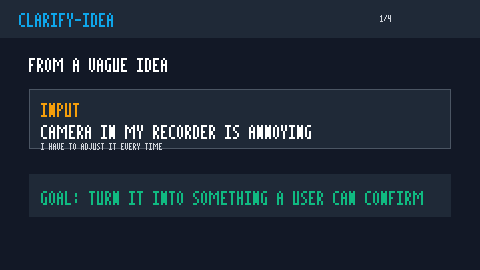

# Clarify Idea

<sub><a href="README.md">中文</a> · <b>English</b></sub>

> Turn a vague idea into a brief that others can execute, AI can continue from, and the user can personally verify.

`clarify-idea` is a reusable cross-agent skill / prompt package for requirement clarification. It is designed for early ideas, rough product requests, workflow changes, content plans, and users who do not speak in product or engineering terms yet. The skill slows the agent down at the right moment: clarify first, execute later.

[See the Demo](#demo) · [Quick Start](#quick-start) · [When to Use It](#when-to-use-it) · [Safety Boundaries](#safety-boundaries) · [Validation](#validation)

## Demo



Raw idea:

```text
The camera in this screen recorder is annoying. I have to adjust it every time.
```

Clarified requirement:

```text
The user wants to record tutorial videos on Windows with a visible camera overlay. After selecting a camera, the preview should appear immediately and support moving and resizing. The camera should stay visible during recording, appear once in the exported video, and preserve the selected device, position, size, and microphone choice after the app is closed and reopened.
```

More replayable examples:

- [Screen recorder camera settings](examples/tool-camera-settings.md)
- [AI tools content account](examples/content-ai-account.md)
- [Risky customer messaging tool](examples/risky-customer-messaging.md)

### Showcase Card

| Raw Input | Delivered Output | Validation |
|---|---|---|
| The screen recorder camera is annoying and always needs adjustment | [Camera settings clarification](examples/outputs/tool_camera_settings.output.md): covers ideal state, reopen behavior, export consistency, and acceptance steps | 5/5 matched |
| I want to make an AI tools account but do not know how to explain it | [AI tools account clarification](examples/outputs/content_ai_account.output.md): defines target users, first-stage plan, open questions, and acceptance steps | 5/5 matched |
| Help me build a tool that automatically messages customers in bulk | [Customer messaging risk clarification](examples/outputs/risky_customer_messaging.output.md): adds human confirmation, privacy, opt-out, and send-report boundaries | 5/5 matched |

See the full replay index in [examples/outputs](examples/outputs/README.md).

## When to Use It

- The user has a rough idea but needs it made clear before execution.
- The idea needs to be explained to an AI agent, developer, designer, editor, or teammate.
- The user wants to reduce rework caused by building from an underspecified request.
- The idea is about software, tools, content, workflow, product experiments, or project planning.
- The output should become a lightweight PRD, executable spec, or acceptance checklist.
- The user cannot write code but still needs to confirm and verify the result.

## What It Delivers

By default, the skill produces an idea clarification brief:

```md
## Requirement Restatement

## Background and Scenario

## Current Problem

## Ideal State

## Executable Requirements

## Out of Scope

## Risks

## Acceptance Checklist

## Next Step
```

For more complex work, the output can be upgraded into:

- Lightweight PRD
- Executable spec
- Given/When/Then acceptance cases

## Quick Start

### Codex

Tested one-line install:

```bash
npx --yes skills add zhouzilai626/clarify-idea-skill --skill clarify-idea --agent codex --copy -y
```

You can also manually copy the whole `clarify-idea` directory into your local Codex skills directory, for example:

```text
~/.codex/skills/clarify-idea
```

Then say to the AI:

```text
Clarify this idea first. Do not implement it yet. Turn it into a requirement brief that I can confirm, another person can execute, and I can verify myself.
```

### Claude / Claude Code

If your Claude environment supports skills, copy this directory to the corresponding Claude skills path:

```text
.claude/skills/clarify-idea
```

If you only want a slash command, copy this file into your Claude commands directory:

```text
.claude/commands/clarify-idea.md
```

### OpenCode

If your OpenCode environment supports Agent Skills, use:

```text
.opencode/skills/clarify-idea
```

If you only want a command, use:

```text
.opencode/commands/clarify-idea.md
```

### Other AI Tools

If your tool does not support skill files, copy the generic prompt:

```text
prompts/clarify-idea.prompt.md
```

## Trigger Examples

Say things like:

```text
Use clarify-idea to organize this request. Do not implement it yet.
```

```text
Turn this idea into a lightweight PRD and acceptance checklist.
```

```text
I cannot code. Help me explain this requirement to a developer.
```

```text
Please rewrite this into a spec that an AI agent can implement next.
```

## Safety Boundaries

- Do not treat a vague idea as permission to execute.
- Do not invent budgets, platforms, target users, technical solutions, or acceptance criteria.
- Do not default to a heavy PRD; early ideas should become short, confirmable briefs first.
- If the request involves data deletion, automated messaging, payments, public publishing, private data, or account permissions, list the risk and ask for confirmation.
- If the user provides private or commercially sensitive information, keep only the abstract details needed to clarify the requirement.

## Validation

The repository includes `test-prompts.json` with 3 replayable tests and recorded outputs under `examples/outputs/`.

| Test | Raw Input | Expected Coverage |
|---|---|---|
| `tool_camera_settings` | Screen recorder camera is annoying | ideal state, reopen behavior, camera, acceptance checklist |
| `content_ai_account` | Wants to build an AI tools account | target users, first stage, open questions, acceptance checklist |
| `risky_customer_messaging` | Automated customer bulk messaging | risks, human confirmation, privacy, opt-out, acceptance checklist |

Validation flow:

1. Send the `prompt` to an AI with this skill installed.
2. Check that the output contains the key items in `expected_contains`.
3. Confirm the acceptance checklist contains concrete actions the user can perform.
4. Compare the new output with `examples/outputs/` and make sure safety boundaries, open questions, and acceptance steps were not lost.

Public install check:

```bash
npx --yes skills add zhouzilai626/clarify-idea-skill --skill clarify-idea --agent codex --copy -y
```

Verified result: the CLI can clone the public repository, detect 1 skill, and copy-install `clarify-idea` into a temporary Codex test project.

Regenerate the demo GIF:

```bash
node scripts/render-demo-gif.mjs
```

## Compatible Platforms

This repository is organized as one core skill plus adapters for multiple agent runtimes.

| Platform / Tool | Usage | Path |
|---|---|---|
| Codex | Use the root `SKILL.md`, or copy the whole repository into a Codex skills directory | `SKILL.md`, `agents/openai.yaml` |
| Claude / Claude Code | Use the Claude skills directory, or copy the slash command | `.claude/skills/clarify-idea/SKILL.md`, `.claude/commands/clarify-idea.md` |
| OpenCode | Use the OpenCode skills directory, or copy the command | `.opencode/skills/clarify-idea/SKILL.md`, `.opencode/commands/clarify-idea.md` |
| AGENTS.md-compatible tools | Read the root agent instructions | `AGENTS.md` |
| OpenClaw-like SKILL.md tools | Use the SKILL.md-compatible directory | `openclaw/skills/clarify-idea/SKILL.md` |
| Hermes / other AI tools | Copy the generic prompt | `prompts/clarify-idea.prompt.md`, `hermes/clarify-idea.prompt.md` |
| Generic Agent Skills repository structure | Use as one skill inside a multi-skill repository | `skills/clarify-idea/SKILL.md` |

## File Structure

```text
clarify-idea/
├── SKILL.md
├── README.md
├── README.en.md
├── LICENSE
├── test-prompts.json
├── assets/
│   └── demo.gif
├── scripts/
│   └── render-demo-gif.mjs
├── examples/
│   ├── content-ai-account.md
│   ├── risky-customer-messaging.md
│   ├── tool-camera-settings.md
│   └── outputs/
│       ├── README.md
│       ├── content_ai_account.output.md
│       ├── risky_customer_messaging.output.md
│       └── tool_camera_settings.output.md
├── AGENTS.md
├── agents/
│   └── openai.yaml
├── .claude/
│   ├── skills/clarify-idea/SKILL.md
│   └── commands/clarify-idea.md
├── .opencode/
│   ├── skills/clarify-idea/SKILL.md
│   └── commands/clarify-idea.md
├── .agents/
│   └── skills/clarify-idea/SKILL.md
├── skills/
│   └── clarify-idea/SKILL.md
├── openclaw/
│   └── skills/clarify-idea/SKILL.md
├── hermes/
│   └── clarify-idea.prompt.md
└── prompts/
    └── clarify-idea.prompt.md
```

## How It Differs from a Generic PRD Prompt

| Dimension | Generic PRD Prompt | clarify-idea |
|---|---|---|
| Default user | Someone whose requirement is already clear | Someone with a vague idea or no technical vocabulary |
| Output depth | Often jumps straight to a long PRD | Starts with a short clarification brief, then upgrades only when needed |
| Acceptance | Often says "works normally" | Requires checks the user can personally perform |
| Risk boundary | Often missing | Explicit out-of-scope, risk, and confirmation points |
| Runtime support | Usually one prompt | Provides `SKILL.md`, commands, `AGENTS.md`, and generic prompt variants |

## References

- Claude Code docs: [Extend Claude with skills](https://code.claude.com/docs/en/skills)
- OpenCode docs: [Agent Skills | OpenCode](https://opencode.ai/docs/skills/)
- AGENTS.md shared instruction format: [AGENTS.md](https://agents.md/)
- Anthropic examples: [anthropics/skills](https://github.com/anthropics/skills)

## Release Prep

- [Publication checklist](PUBLICATION_CHECKLIST.md)
- [Release notes draft](RELEASE_NOTES.md)

## License

[MIT](LICENSE)
